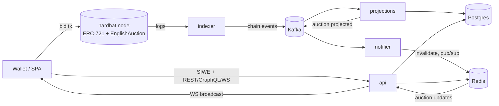

# ChainBid

An NFT auction platform where bids are placed on-chain and the backend turns chain logs into
read models: **Solidity → indexer → Kafka → projections → REST/GraphQL/WebSocket**.

The interesting part is not the auction — it is the pipeline that keeps a Postgres read model
correct in the face of reorgs, restarts, and out-of-order events.



## Layout

```
apps/api        NestJS: REST + GraphQL + WS gateway, SIWE auth, health/metrics
apps/indexer    chain log poller (reorg-safe cursor) → Kafka producer
apps/worker     Kafka consumers: projections, notifier, outbox relay, settlement watcher
apps/web        Vite + React SPA: wagmi wallet connect, live auctions, bidding
contracts       Hardhat: ChainBidNFT (ERC-721), EnglishAuction
packages/db     Kysely migrations (source of truth) + types generated from the live schema
packages/shared Kafka topics, zod event contracts, cache keys, ABI fragments
e2e             full-loop test driven by CI
```

## Pipeline guarantees

- **Confirmation depth** — the indexer only reads blocks ≥ N confirmations old (N=5).
- **Reorg detection** — the cursor stores `(block number, hash)`; if that block leaves the
  canonical chain, the cursor rewinds by the confirmation depth and re-emits.
- **At-least-once everywhere** — publish happens before the cursor/outbox mark; consumers absorb
  duplicates: bids are append-only with unique `(tx_hash, log_index)`, auction updates are guarded
  by `last_event_block`.
- **Resumability** — kill anything, restart it, it catches up from its cursor / consumer offset.
  Dropping the whole database and restarting reprojects everything from the chain.

## What the backend exposes

- `GET /auth/nonce` → sign an EIP-4361 message → `POST /auth/verify` → JWT (nonces in Redis,
  single-use via `GETDEL`).
- `GET /auctions`, `GET /auctions/:id`, `GET /auctions/:id/bids` — Redis-cached read models,
  invalidated by the projection pipeline, short TTL as safety net.
- `POST/DELETE /auctions/:id/watch`, `GET /watchlist` — JWT-guarded; writes go through a
  transactional outbox relayed to Kafka.
- `POST /graphql` — code-first schema: `auctions` connection (keyset pagination), `auction` with
  nested bids resolver.
- `WS /ws` — raw WebSocket; subscribe per auction id, receive `auction.created` / `bid.placed` /
  `auction.settled` frames fanned out via Redis pub/sub (multi-instance safe).
- `GET /health` (postgres, redis, rpc, indexer lag), `GET /metrics` (Prometheus: default metrics,
  HTTP latency histogram by route pattern, indexer lag gauge).

## Quickstart

```bash
corepack enable          # provides pnpm from packageManager
pnpm install
cp .env.example .env
docker compose up -d     # postgres + redis + kafka
pnpm build

# chain: local node + contracts (addresses in .env match a fresh node)
pnpm --filter @chainbid/contracts exec hardhat node        # terminal 1
pnpm --filter @chainbid/contracts exec hardhat ignition deploy ignition/modules/ChainBid.ts --network localhost

# database schema
set -a; source .env; set +a
pnpm --filter @chainbid/db migrate

# services (terminals 2-4, or pnpm dev in each for watch mode)
pnpm --filter @chainbid/indexer start
pnpm --filter @chainbid/worker start
pnpm --filter @chainbid/api start

# the whole loop: mint → auction → 3 bids → auto-settlement,
# asserted over REST, GraphQL, and a captured WS stream
pnpm e2e

# frontend (http://localhost:5173) — needs MetaMask on the Hardhat network
pnpm --filter @chainbid/web dev
```

To click through the UI, add the Hardhat network to MetaMask (RPC `http://localhost:8545`,
chain id 31337) and import one of the well-known hardhat accounts. Sell mints an NFT and opens an
auction; the auction page shows the GraphQL bid history and a live WebSocket feed — place a bid
and watch it come back through the pipeline.

Checks: `pnpm lint`, `pnpm typecheck`, `pnpm test`, `pnpm format:check`. CI runs those, a
schema-drift job (re-derives Kysely types from the migrations against a fresh Postgres), and the
full e2e above on every push.

## Design notes

- **Bids are on-chain and escrowed**, refunds are pull-payments — the architecture of single-item
  timed auctions, where low bid counts make per-bid gas negligible and escrow means a winning bid
  cannot fail to pay. It also makes the indexer the load-bearing component rather than a formality.
  The alternative — an off-chain order book of signed bids with on-chain settlement, what
  high-volume marketplaces run — trades that guarantee for gas-free offer revision; a single-item
  auction does not need to make that trade.
- **Types flow from the database to the UI**: migrations are the source of truth, the Kysely types
  in `packages/db/src/schema.ts` are generated from the migrated schema (never edited by hand, CI
  fails on drift), and the api, worker, and SPA all consume the same zod-validated snapshot types
  from `packages/shared` — one unbroken chain from a Postgres column to a React prop.
- **Event schemas live in code**: zod contracts in `packages/shared`, enforced at both produce and
  consume time; producer and consumer import the same package, so drift is a compile error.
- **API-originated events use the transactional outbox pattern** — the state change and the event
  commit in one Postgres transaction, and a relay moves unpublished rows to Kafka, so neither can
  exist without the other. The relay polls (partial index on unpublished rows); at scale the same
  table feeds CDC.
- **Wei is `numeric(78,0)`** and travels as decimal strings end to end — `uint256` never touches
  JS number range.

## Scope cuts

Stated so they read as scoping, not oversight:

- The frontend is a demo client — no responsive pass, no accessibility audit, no SSR. Injected
  wallets only; the SIWE message is built by hand, keeping the siwe package and its ethers peer
  out of the browser bundle (the server verifies with the real library).
- Local Hardhat chain only; switching to a public network is an RPC env var.
- No IPFS pinning, no marketplace fees or royalties.
- Notifications stop at the outbox consumer — a real delivery channel would hang off it.
- Nest's default logger, no request-id propagation through Kafka headers, no schema registry.
